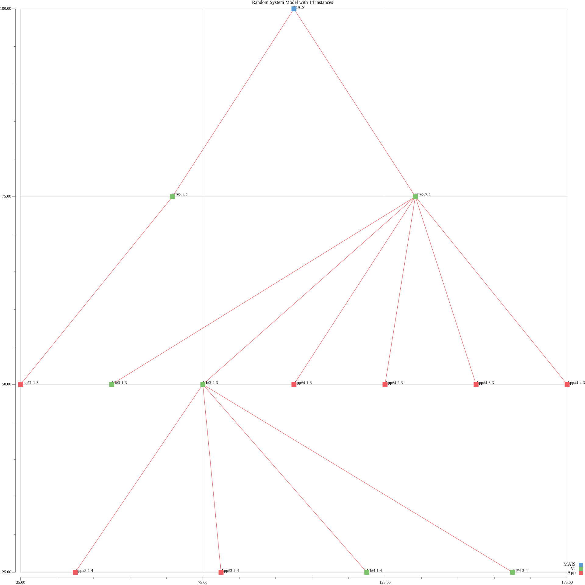

# Fractal Multi-Agent System
This repository contains a codebase for benchmarking computational complexity of the Fractal Multi-Agent System (FMAIS) model
and Multi-Environment Enhanced Real-Time Customer-Oriented Reliability Model (ME-ERT-CORE).

This repository also serves as a library for the future usage of these models. It also implements in Go a
Enhanced Real-Time Customer-Oriented Reliability Model (ERT-CORE) presented in [[1]](https://ieeexplore.ieee.org/document/9663391).

> If you want to re-use this code, please kindly refer to this repository and mention all authors!


# Background
**Fractal Multi-Agent IoT System** (FMAIS) model is a fractal-based mathematical model for describing scalable Multi-Agent IoT Systems (MAIS).
It is based on the Iterated Function System (IFS) definition, a special type of a fractal, which is self-replicable (i.e., each next level of the FMAIS
is computed based on the previous level). Time complexity of such system is exponential with the increasing number of levels in the FMAIS, and square dependence 
(approximated with a polynom of a second degree and a coefficient - complexity raise is not that steep) with the increasing number of applications inside the FMAIS.
Following figure describes such system.



**Multi-Environment Enhanced Real-Time Customer-Oriented Reliability Model** (ME-ERT-CORE) is a next step in the ERT-CORE model evolution introduced in [[1]](https://ieeexplore.ieee.org/document/9663391).
It has the same basement as ERT-CORE, which makes its time complexity linearly dependent on the growing number of applications in the system.
ME-ERT-CORE unifies reliability estimation by allowing any reliability metrics at its input.

If you want to learn more about the FMAIS and ME-ERT-CORE, please refer to **leave a reference to the upcoming publication here!!**.


## Prerequisites
Necessary prerequisites for running this project are:
- `Golang`
- `make`


## Repository structure
Repository is structured in the following way:

- `build/` contain a generated binary and a Dockerfile
- `cmd/` contain a main entry point to the program
- `data/` contain measured data from the experiment
- `figures/` contain figures generated from the data stored in `data` directory
- `pkg/` contain various helper packages for the experiment


## Usage
Main targets are defined in a `Makefile`, here are the main ones:
- `make build` - builds the project
- `make bench` - runs a full benchmark (FMAIS + ME-ERT-CORE) and generates figures
- `make docker-bench` - runs a full benchmark in Docker container, generated data and figures 
are stored in corresponding directories
- `make bench-sm` - runs a benchmark just for FMAIS model
- `make bench-rm` - runs a benchmark hust for ME-ERT-CORE model
- `make example` - generates a figure of a randomly generated FMAIS
- `make generate-figures` - generates figures out of provided input files (defined in Makefile target)
- `make test` - runs unit tests for this repository
- `make gobench` - runs a benchmark with a `gobench` (this option is experimental and **DO NOT** cover the whole measurement!!)

To see all options, please refer to `make help`.

Currently, benchmarking is configured with following parameters:
- `iterations` is equal to `25'000` (specifies number of iterations performed for each parameter set, this is to isolate 
an OS resource fluctuation)
- `depth` is `4` (depth of a FMAIS model)
- `appNumber` is `100` (number of applications inside FMAIS model)
- `maxNumInstances` is `100` (number of instances per application inside FMAIS)

It is also possible to customize the input parameters, you can do so by specifying the aforementioned parameters in the following way:
```bash
build/_output/fractal-mais --benchmark --iterations 10000 --depth 3 --appNumber 50 --maxNumInstances 20
```
It will then run a full benchmarking (FMAIS + ME-ERT-CORE) for randomly generated FMAIS of depth `3` with `50` applications and `20` instances per application.

To see a full set of input parameters, run `build/_output/fractal-mais --help`.


## Brief experiment description
The experiment was performed on the UpBoard with 8 Gb of RAM and four-cores and four-thread Intel
Atom® x7-E3950 CPU.

Results are stored inside the `data/` directory. You can find here following files:
- `benchmark_fmais_*` - stores measured time of FMAIS System Model generation
- `maxNumInstances_fmais_*` - stores maximum number of instances generated during FMAIS benchmarking
- `benchmark_meertcore_*` - stores measured time of ME-ERT-CORE computation
- `benchmark_average_reliability_*` - stores average reliability for given input FMAIS data (i.e., depth, maximum number of
applications, maximum number of instances per application)
- `benchmark_maximum_reliability_*` - stores maximum computed reliability during ME-ERT-CORE benchmarking
- `benchmark_minimum_reliability_*` - stores minimum computed reliability during ME-ERT-CORE benchmarking
- `maxNumInstances_meertcore_*` - stores maximum number of instances generated during ME-ERT-CORE benchmarking

During the experiment, measured time for FMAIS generation of depth `4` with `81` application and `101` instances per application
was **90.887** ms. It took **48.434** ms to compute the reliability of this system with ME-ERT-CORE (per definition). 
Fractal MAIS system model at this iteration contained `1'009'669` instances.

Figures illustrating measured time complexity of the FMAIS can be found under `figures/` directory.

To learn more, refer to the publication **leave a reference to the upcoming publication here!!**.


## Measurement fluctuation
This is to describe fluctuation in the results of the measurement.
There are two sources of fluctuation which may potentially affect result:
- floating point computation
  - it is usually represented by fluctuation (random 1) in the 10-12th digit after the comma (e.g., `0.000'000'000'001`)
- random generation of the instances in FMAIS
  - at one iteration system can contain `50'000` instances, and at the other iteration - `500'000`. This is 
  being spread with taking an average value over the `25'000` iterations.

Result are in μs (i.e., `10^-6`), thus errors in 10th or 12th digit after the comma do not have an impact on the final result.

**With regard to the aforesaid, fluctuation in the measurement results is neglectable.**


## Short background on performance estimation in Golang
There are currently two ways of measuring performance in Go:
1. Old school way by measuring of the function execution time,
   more [here](https://yourbasic.org/golang/measure-execution-time/).
2. Using `gobench` utility (requires `testing` package),
   more [here](https://blog.logrocket.com/benchmarking-golang-improve-function-performance/).


# Limitations
The main limitation is hardware resources. For the depth `4` and number of applications `100` with `100` instances per application the model can consume up to 6-7Gb of RAM.
With these parameters the FMAIS generates a total number of instances, which is around `1'000'000`. 


## Authors and acknowledgement
> This research was funded by CTU in Prague, grant no. SGS21/161/OHK3/3T/13.

**Ivan Eroshkin** received a BSc degree in electrical engineering from Czech Technical University in Prague, Czech Republic, in 2017, a MSc degree in electrical engineering from Czech Technical University in Prague, Czech Republic, in 2020 and a MSc degree in mobile computing systems from EURECOM, Sophia Antipolis, France, in 2020. He is currently pursuing a PhD degree in electrical engineering at Czech Technical University in Prague, Czech Republic.

In 2019, he was a research intern in the Nokia Bell Labs, Paris, France. From 2020 to 2021, he was a research intern in the Open Networking Foundation, Menlo Park, California, USA. His research interests include the development of software-defined networks and future Internet of Things, software virtualisation, optimisation techniques for embedded devices.


**Lukas Vojtech** received his MSc and PhD degree in telecommunication engineering from the Czech Technical University in Prague, Czech Republic in 2003 and 2010, respectively. He is now Associate Professor at the Department of Telecommunication Engineering at the Czech Technical University in Prague, Czech Republic.

From 2006 to 2007, he has joined Sitronics R&D centre in Prague, focusing on hardware development. From 2012, he has participated in Eureka founded projects AutoEPCIS and U-Health (member of the project coordination committees) and national (CZ government) projects
NANOTROTEX, BE-TEX, KOMPOZITEX and RFID LOCATOR. In the last five years, he has acted as project leader and member of the project coordination committees. His current research activities include electromagnetic compatibility, radio frequency identification, Internet of Things and hardware development.

Lukas Vojtech is a Member (M) of IEEE Czechoslovakia Section from year 2011, IEEE Region: R8 -Europe.


**Marek Neruda** received his MSc and PhD degree in telecommunication engineering from the Czech Technical University in Prague, Czech Republic in 2007 and 2014 respectively. He is now a researcher at the Department of Telecommunication Engineering at the Czech Technical University in Prague, Czech Republic.

From 2012, he has participated in Eureka founded projects AutoEPCIS and U-Health and national (CZ government) projects NANOTROTEX, KOMPOZITEX and RFID LOCATOR. His current research activities include electromagnetic compatibility, radio frequency identification and Internet of Things.


# References
[[1]](https://ieeexplore.ieee.org/document/9663391) I. Eroshkin, L. Vojtech and M. Neruda, "Resource Efficient Real-Time Reliability Model for Multi-Agent IoT Systems," 
in IEEE Access, vol. 10, pp. 2578-2590, 2022, doi: 10.1109/ACCESS.2021.3138931.

[[2]]() **leave a reference to the upcoming publication here!!**
